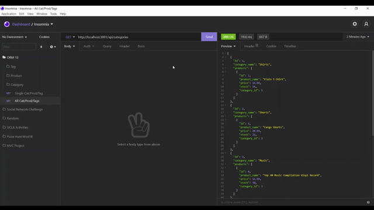
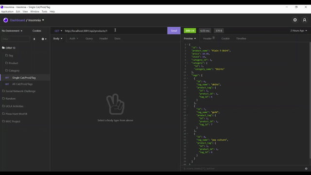
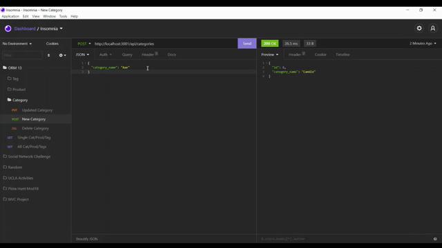
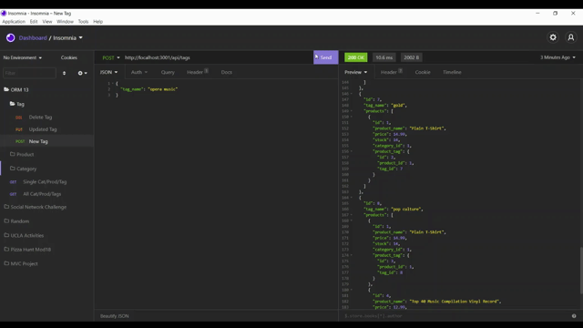

## E-Commerce Back End

# Description
The e-commerce back end is an application that showcases the work behind the scenes of a typical e-commerce website.

# Technologies Used
- Express
- Node
- MySQL
- Sequelize

# Walkthrough Video
- Showing Dependencies, seeding the Database, and starting the server

- Showing Schema & MySQL

- All GET routes

- All Single GET routes

- Category POST, PUT, DELETE

- Products POST, PUT, DELETE

- Tags POST, PUT, DELETE

